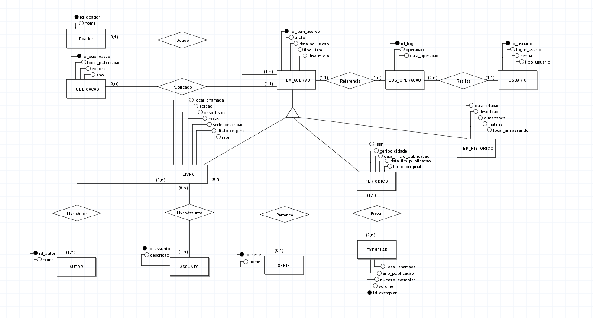
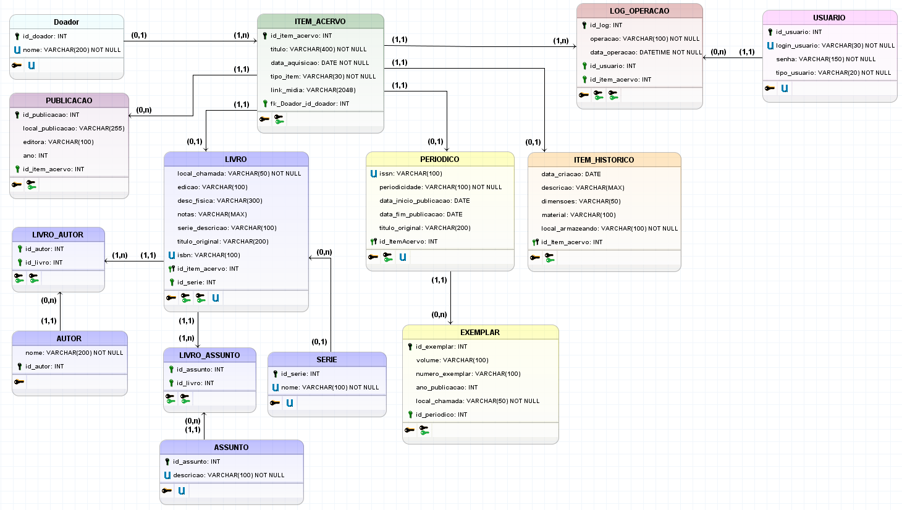

# Sistema de Gerenciamento de Biblioteca e Acervo Histórico - Museu Treze de Maio

## DESCRIÇÃO DO PROJETO
Esse projeto foi realizado com o intuito de gerenciar o acervo bibliográfico e histórico do Museu Treze de Maio, respeitando as particularidades de cada tipo de item dentro do acervo. 

## Sumário
- [Funcionalidades](#funcionalidades)
- [Modelagem do Banco de Dados](#modelagem-do-banco-de-dados)
- [Ferramentas Utilizadas](#ferramentas-utilizadas)
- [Como Executar o Projeto](#como-executar-o-projeto)
- [Estrutura do Projeto](#estrutura-do-projeto)
- [Interface do Sistema (Protótipo)](#interface-do-sistema-protótipo)

---

## Funcionalidades
O diagrama de Casos de Uso abaixo ilustra as principais interações que os usuários (Administrador e Público) podem ter com o sistema.

*Casos De Uso:*

---

## Modelagem do Banco de Dados
A modelagem foi dividida em duas etapas: conceitual e lógica, garantindo que os requisitos do negócio fossem traduzidos corretamente para a estrutura do banco de dados.

### Modelo Conceitual (DER)
Representa as entidades, seus atributos e os relacionamentos entre elas.

*Modelo Conceitual: *

### Modelo Lógico
Mapeia o modelo conceitual para uma estrutura de tabelas, com chaves primárias e estrangeiras definidas, assim como o tipo de dado de cada atributo.

*Modelo Lógico: *

---

## Interface do Sistema

---

## Ferramentas Utilizadas
*   **SGBD:** Microsoft SQL Server
*   **IDE:** SQL Server Management Studio (SSMS)
*   **Funcionalidades (Casos de Uso): Astah
*   **Modelagem:** brModelo
*   **Interface do Sistema:**
*   **Controle de Versão:** Git / GitHub (Opcional)

---

## Como Executar o Projeto

### Pré-requisitos
*   Microsoft SQL Server instalado.
*   SQL Server Management Studio (SSMS) ou outra ferramenta de sua preferência para gerenciar o banco.
*   VERSÃO DO JAVA

### Passos para Instalação
1.  Abra o **SQL Server Management Studio (SSMS)** e conecte-se à sua instância do SQL Server.
2.  Abra o arquivo `DDL_db_Museu_Treze_Maio.sql`.
3.  Execute o Script DDL. Este script irá:
    *   Criar o banco de dados `db_museu_treze_maio`.
    *   Criar todas as tabelas com suas respectivas constraints (PK, FK, CHECK, UNIQUE).
    *   Criar os triggers de auditoria.
4.  Abra o arquivo `DML(inserts)_db_Museu_Treze_Maio.sql`.
5.  Execute o script completo para popular o banco de dados com dados de exemplo.
6.  (Opcional) Para verificar se tudo está funcionando, abra e execute o arquivo `Consultas_db_Museu_Treze_Maio.sql`.

7. PARTE DO JAVA...
---

## Estrutura do Projeto
*   `Scripts-SQL/DDL_db_Museu_Treze_Maio.sql`: Script para criação da estrutura do banco de dados (tabelas, constraints, triggers).
*   `Scripts-SQL/DML(inserts)_db_Museu_Treze_Maio.sql`: Script para inserção de dados de exemplo.
*   `Scripts-SQL/Consultas_db_Museu_Treze_Maio.sql`: Exemplos de consultas complexas para extrair informações do banco.
*   `Dicionario-Dados/Dicionario de Dados.md`: Documentação detalhada de cada tabela e atributo do banco.
*   `Modelos-Diagramas`: Arquivos fontes dos modelos e do caso de uso.
*   `Imagens-Diagramas`: Imagens dos diagramas.
